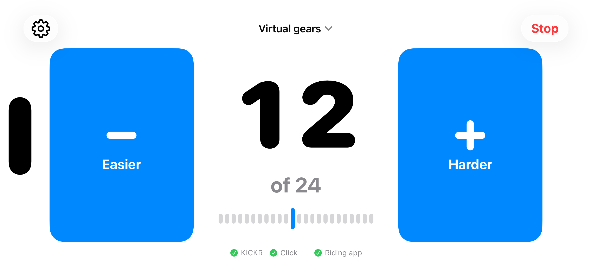

<p align="center">
  
</p>

# Virtual Gears

**Virtual shifting for the Wahoo KICKR V5, controlled from your iPhone.**

Virtual Gears puts an iPhone between your trainer and the app you ride with.
Your riding app still controls the route and its hills; Virtual Gears adds the
gears.



Leave the bike in a quiet, straight chain line and shift virtually instead.
Nothing moves on the bike, so shifting is silent and cannot drop the chain.

**[Read the full documentation](https://sbroenne.github.io/VirtualGears/)**

## Why it exists

Wahoo brought native virtual shifting to newer trainers but has said the KICKR
V5 will not receive it. Virtual Gears fills that gap without changing the route
data from your riding app.

[Read Wahoo's compatibility statement](https://support.wahoofitness.com/hc/en-us/articles/16865097915666-Virtual-shifting-with-Wahoo-smart-trainers)

## What you need

| | Requirement |
|---|---|
| **iPhone** | iOS 17 or later |
| **Trainer** | Wahoo KICKR V5 |
| **Riding app** | An app that can connect to an FTMS trainer; validated against RealVelo |
| **Shift buttons** | Optional original Zwift Click |
| **Fan** | Optional Wahoo KICKR HEADWIND |

The KICKR V5 is the trainer Virtual Gears was built and physically tested
against. Other direct-drive KICKR models may work but are not yet proven. The
KICKR Snap, KICKR Bike and trainers from other brands are not supported.

[Detailed compatibility information](https://sbroenne.github.io/VirtualGears/requirements/#which-trainers-work)

## Your first ride

1. Wake the KICKR by turning the pedals.
2. Open Virtual Gears on the iPhone. It finds and connects to the trainer.
3. In your riding app, connect to the trainer named **Virtual Gears**. Some apps
   may show the iPhone's name instead.
4. Ride and shift with the large **Easier** and **Harder** buttons.

There is no start button and no setup wizard. If several trainers are nearby
and Virtual Gears cannot safely choose one, it asks you.

## What it can do

- **24 ready-made virtual gears**, with extra range for climbing.
- **Real-bike gearing**, built from your chainrings and cassette.
- **On-phone shifting** with large controls in portrait and landscape.
- **Optional Zwift Click shifting** from the handlebar.
- **Optional Headwind control** with Automatic, Off, 25%, 50%, 75% and 100%
  settings.
- **Mid-ride changes** to the trainer, gears, Click or Headwind.
- **Ride continuity** when you answer a call or briefly switch apps.

<p align="center">
  
  
  
</p>

<p align="center">
  
</p>

## How it works

Virtual Gears acts as a Bluetooth FTMS trainer for the riding app and as a
controller for the real KICKR. It passes the riding app's commands and trainer
data through, then applies the selected gear by changing the wheel
circumference configured on the KICKR.

Every change waits for confirmation from the trainer. Ending a ride restores
the wheel circumference that was in use before Virtual Gears applied its gear.

[How the gears work](https://sbroenne.github.io/VirtualGears/how-it-works/) ·
[Safety details](https://sbroenne.github.io/VirtualGears/safety/)

## Important limitations

- **ERG workouts are not supported.** ERG mode controls target power, while
  Virtual Gears controls how hard a gear feels.
- **The riding app cannot display the selected gear.** Bluetooth FTMS has no
  message for reporting it, so the gear is shown on the iPhone.
- **This is not Zwift's native virtual shifting.** It works independently of the
  riding app.

## Development

The app uses Swift 6 and requires Xcode 26 or later.

```bash
swift test
open VirtualGears.xcodeproj
```

- `Sources/VirtualGearsCore` contains the gear, trainer and ride logic.
- `VirtualGearsProduct` contains the iPhone UI and Bluetooth services.
- `Tests/VirtualGearsCoreTests` contains the hardware-independent test suite.
- `Tools` contains the macOS hardware diagnostics used during development.
- `docs` contains the MkDocs website.

See [MAC_SETUP.md](MAC_SETUP.md) for development and hardware-testing
instructions.

## Independent project

Virtual Gears is not affiliated with Wahoo Fitness or Zwift. Wahoo, KICKR,
HEADWIND, Zwift and Zwift Click are trademarks of their respective owners.

## Licence

Copyright &copy; 2026 Stefan Broenner. All rights reserved.

The source is public so it can be read and checked, but it is not open source.
Redistribution and publishing derived applications are not permitted. See
[LICENSE](LICENSE) for the exact terms.
