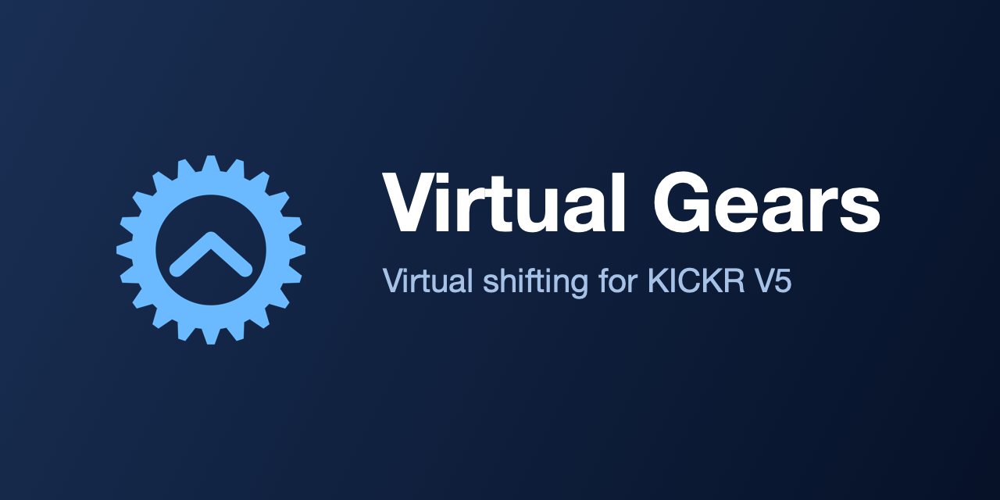
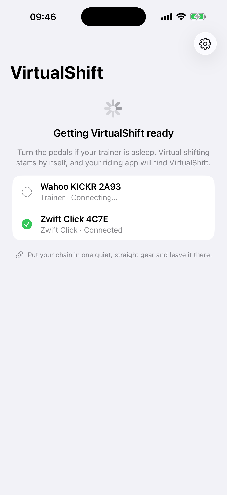
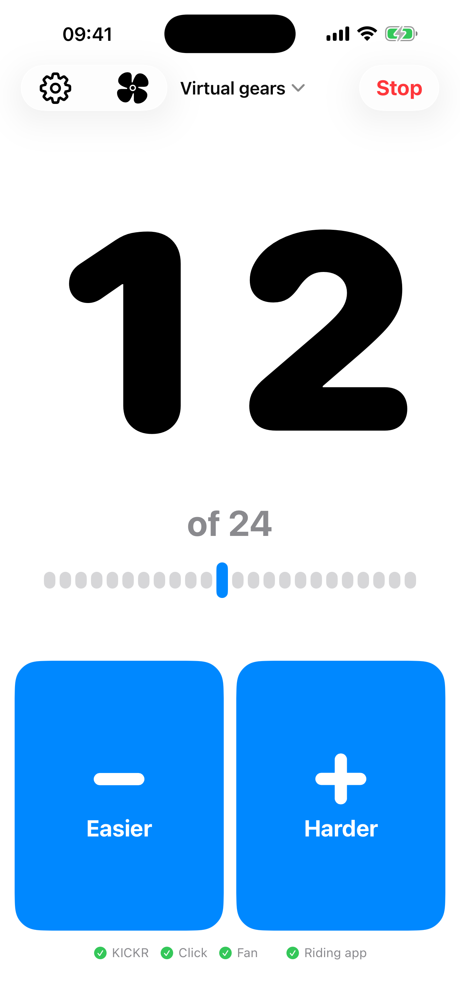
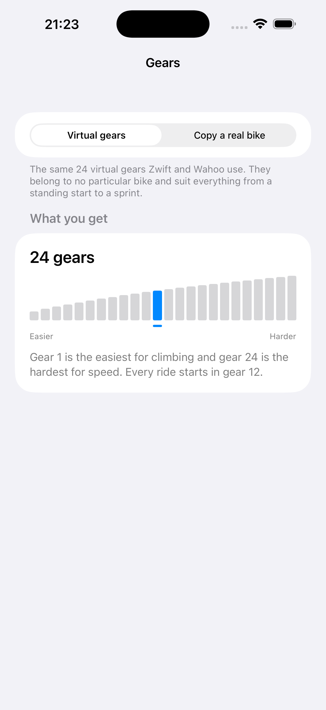
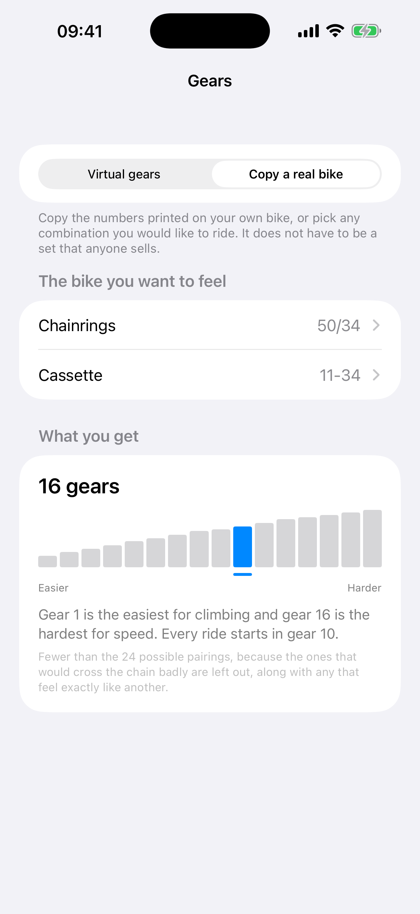

<p align="center">
  
</p>

# VirtualShift

**[Read the full documentation at sbroenne.github.io/VirtualShift](https://sbroenne.github.io/VirtualShift/)**

VirtualShift gives you gears on an indoor trainer that has none.

Your chain stays in one quiet, straight gear all ride. Shifting happens on your
iPhone instead, which changes how hard the trainer feels. Nothing on the bike
moves, so there is no chain noise, no dropped chain, and no wear.

```text
riding app on your computer  <->  iPhone running VirtualShift  <->  KICKR V5
                                              ^
                                              |
                                     Zwift Click (optional)
```

Your riding app connects to the iPhone instead of to the trainer. VirtualShift
passes everything through in both directions, and applies your chosen gear on
top. The riding app still controls the road: hills feel like hills.

<p align="center">
  
  
  
  
</p>

## What you get

**Gears you can see.** Either the 24 virtual gears Zwift and Wahoo use, which suit any bike
and are the starting choice, or a copy of a real bike described by its
chainrings and cassette. A real 50/34 with an 11-34 cassette gives sixteen
gears, running 34x34 up to 50x11 — the gears you would really ride, not every
possible pairing of a ring with a cog.

Whichever you choose is drawn rather than listed: one bar per gear, easiest to
hardest, on a scale where a tall step is a jump the legs will notice. How far
the gears reach and how evenly they are spread are visible at a glance, which no
list of tooth counts can tell you.

**Shifting.** Two large buttons on the phone, placed for sweaty hands and a
locked-out gaze. An original Zwift Click can be added and shifts the same
gears, but it is never required and nothing ever waits for it.

**Nothing to set up.** Open the app. It looks for your trainer, connects to it,
starts the session and appears to your riding app, all on its own. There is no
setup to complete and no button to press.

The only question it ever asks is which trainer, and only when it genuinely
cannot tell: one trainer nearby is simply used, several are only chosen
automatically when one is clearly closest. Bluetooth reaches through walls, and
connecting to a neighbour's trainer would change their wheel size, so anything
ambiguous is asked rather than guessed.

**Everything changeable mid-ride.** Trainer, gears and Click can all be changed
from the ride screen. Changing gears rebuilds them in place, without
interrupting the ride, so the riding app on your PC never notices.

**A ride survives an interruption.** Taking a call, tapping a notification or
switching to another app does not end your ride. The trainer stays connected and
your riding app stays paired, so you can come back to the same gear.

## What it does not do

ERG mode. A workout that sets a target power is refused, because holding a power
target and holding a gear are two different ideas of what the trainer should
feel like. VirtualShift still tells riding apps it is a trainer they can steer,
so it appears in their trainer list rather than as a bare power sensor.

## How the gears work

The KICKR has no virtual-shifting protocol of its own. VirtualShift uses a Wahoo
command that changes the trainer's idea of your wheel size: a smaller wheel
covers less ground per pedal stroke, which feels like an easier gear. The riding
app's own terrain command is left untouched, so the two never fight.

Every gear is scaled away from a 2070 mm reference. The trainer accepts
that scaling over a lopsided range — about 2.3 times harder but 3.2 times easier
— so the starting gear is placed where the tighter end has the most room, rather
than in the middle. A drivetrain too wide to fit is refused at setup rather than
mid-ride.

Some riding apps, FulGaz among them, set a wheel size of their own. VirtualShift
honours it: that size becomes the new reference and every gear is rebuilt around
it, so the gear you are in keeps feeling the way it did and the app's number is
what the trainer is left sitting at. If the gears would no longer fit inside the
proven range around that size, the request is declined and the ride carries on
at the size it already had.

## Safety

The 646.9-4800 mm range was confirmed on a physical KICKR V5, every value
acknowledged by the trainer, with the reference restored between each probe.
VirtualShift never asks for anything outside it, and every ride ends by putting
the trainer back to where it started: 2070 mm, or the wheel size the riding app
set if it set one.

Wheel size is sent in tenths of a millimetre, so what the trainer receives is
what the safety check judges.

The trainer works out its speed from that wheel size, so a value left behind
would quietly distort the speed and distance of any ride that did not use
VirtualShift. If iOS ends the app before a ride can stop, the size the ride
borrowed is still written down, and the next launch puts it back without saying
anything about it.

## Why it exists

Zwift added virtual shifting in 2024 and Wahoo brought it to their newer
trainers. The KICKR V5 was left out, and Wahoo's
[support page](https://support.wahoofitness.com/hc/en-us/articles/16865097915666-Virtual-shifting-with-Wahoo-smart-trainers)
says so permanently:

> We have reviewed the hardware and firmware capabilities of KICKR v5 (2020) and
> preceding KICKR versions. Unfortunately, these older models are unable to
> support the required protocols for virtual shifting using the Zwift protocol
> and will not be receiving a future update for this functionality.

VirtualShift gives a KICKR V5 gears anyway, and does it in every riding app
rather than only Zwift and Rouvy. The riding app will not display the gear —
there is no message in the Bluetooth standard for reporting one — so the phone
shows it instead.

## Requirements

- iPhone running iOS 17 or later, which is any iPhone from the XS onwards
- Wahoo KICKR V5. Other Wahoo KICKR models should work but are untested; the
  KICKR Snap and KICKR Bike do not, because they change gear other ways. See
  [Which trainers work](https://sbroenne.github.io/VirtualShift/requirements/#which-trainers-work).
- A riding app that supports FTMS trainers. Development is validated against
  RealVelo; Zwift, FulGaz and others use the same interface.
- Optionally, an original Zwift Click

## Repository

- `Sources/VirtualShiftCore` — the parts with no iPhone in them: command
  encoding, gear ratios, drivetrain building, trainer limits, and the ride
  itself. This is where the tests live. The ride reaches the trainer, the
  riding app and the Click through narrow protocols, so a whole session can be
  run against stand-ins with no hardware in the room.
- `VirtualShiftProduct` — the app you ride with: the screens, and the real
  Bluetooth behind those protocols.
- `VirtualShift` — a hardware lab used to prove trainer behaviour. It is not
  the product and is not needed to ride.
- `docs/screenshots` — the screens above, captured from the simulator.
- `docs/` — also the source of the website, built with MkDocs Material.

## Development

```bash
swift test
```

The app is written in Swift 6 language mode, so the compiler checks that the two
Bluetooth conversations — one to the trainer, one to the riding app — never
touch the same data at the same time. That class of bug otherwise shows up as a
freeze in the middle of a ride and is close to impossible to reproduce. Building
needs Xcode 26 or later.

Both app targets are built in CI. The Hardware Lab is not shipped to anyone, but
every trainer fact in these docs was measured with it, so a broken Lab is a
broken instrument.

The app itself must be built and signed in Xcode. Open `VirtualShift.xcodeproj`,
choose the `VirtualShift` scheme and a physical iPhone, and select your
development team under Signing & Capabilities. See `MAC_SETUP.md` for the
hardware procedures.

A successful build or a successful CoreBluetooth write is not hardware evidence.
A trainer command counts as proven only when the trainer replies to confirm it.

To work on the website:

```bash
pip install -r docs/requirements.txt
mkdocs serve
```

## Licence

Copyright &copy; 2026 Stefan Broenner. All rights reserved.

The source is public so it can be read and checked, but it is not open source:
you may not redistribute it or publish an app derived from it. See
[LICENSE](LICENSE) for the exact terms.
