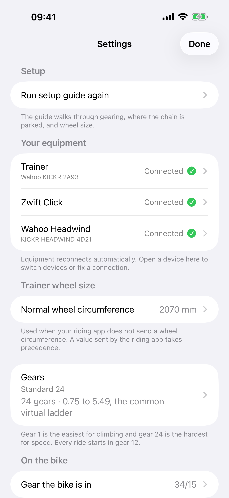

# See it working

!!! info "The ride video is not filmed yet"

    A film of a real ride needs a real bike and a real trainer, so it cannot be
    generated. This page is ready for it, and the shot list is in
    `docs/DEMO_VIDEO.md` in the repository.

    In the meantime, [the animation on the How the gears work
    page](how-it-works.md) shows what the app is doing.

<!-- When the video exists, replace the admonition above with this block and
     point src at wherever the file is hosted:

<video controls preload="metadata" poster="screenshots/riding.png" width="100%">
  <source src="https://github.com/sbroenne/VirtualGears/releases/download/demo/virtual-gears-demo.mp4" type="video/mp4">
  Your browser cannot play this video.
</video>
-->

## What a ride looks like

<figure markdown>
  { width="280" }
  <figcaption>Open the app and it goes looking for your trainer. There is
  nothing to press. Optional equipment reconnects by itself.</figcaption>
</figure>

<figure markdown>
  { width="280" }
  <figcaption>The ride screen. Two large buttons, a gear number big enough to
  read from the saddle, a fan button when a Headwind is added, and live
  connection state along the bottom.</figcaption>
</figure>

<figure markdown>
  { width="280" }
  <figcaption>An optional Headwind can stay on Automatic or use a manual speed.
  Common speeds take one tap, and Slower and Faster are large enough to use on
  the bike.</figcaption>
</figure>

<figure markdown>
  { width="280" }
  <figcaption>One compact Settings screen shows what is connected, what is only
  remembered, and what has not been added.</figcaption>
</figure>

<figure markdown>
  { width="280" }
  <figcaption>Your gears, drawn rather than listed. A tall step is a jump your
  legs will notice.</figcaption>
</figure>

<figure markdown>
  { width="280" }
  <figcaption>Or describe a real bike, and ride its gears instead.</figcaption>
</figure>
