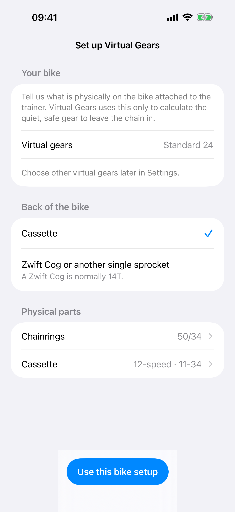
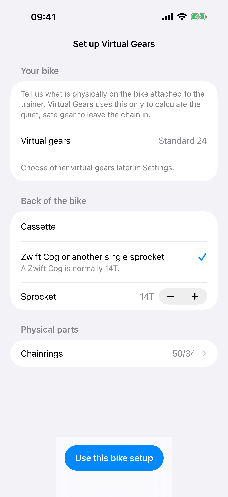
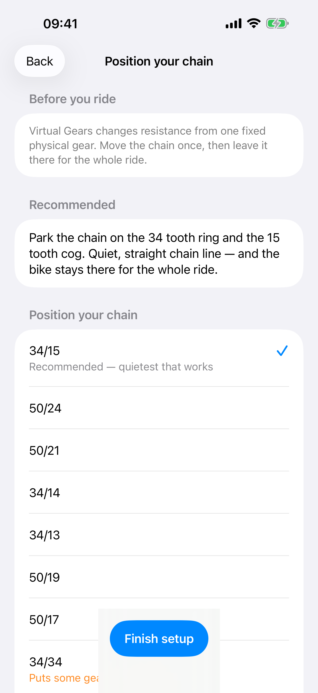

# Virtual Gears

  

**Virtual Gears gives you gears on a trainer — and in a riding app — that has
none.**

Use the smaller front ring if your bike has one, then pick a rear gear that keeps
the chain straight and leave it there. Shifting happens on your iPhone instead,
which changes how hard the trainer feels. Nothing on the bike moves, so there is
no chain noise, no dropped chain, and no wear.

!!! quote "Why this exists"

    Zwift added virtual shifting in 2024, and Wahoo brought it to their newer
    trainers. The KICKR V5 was left out, [permanently][wahoo]:

    > "We have reviewed the hardware and firmware capabilities of KICKR v5
    > (2020) and preceding KICKR versions. Unfortunately, these older models
    > are unable to support the required protocols for virtual shifting using
    > the Zwift protocol and will not be receiving a future update for this
    > functionality."

    Virtual Gears gives a KICKR V5 gears anyway. Because it appears as a normal
    FTMS trainer, it also brings virtual shifting to riding apps that do not
    provide their own.

    The app was built and physically tested with a KICKR V5. Other direct-drive
    KICKR models are expected to work but have not yet been physically tested.

  [wahoo]: https://support.wahoofitness.com/hc/en-us/articles/16865097915666-Virtual-shifting-with-Wahoo-smart-trainers

[See it working](demo.md){ .md-button .md-button--primary }
[What you need](requirements.md){ .md-button }

---

## What it is

Your riding app connects to the iPhone instead of to the trainer. Virtual Gears
passes everything through in both directions, and applies your chosen gear on
top. The riding app still controls the road: hills feel like hills. It does not
need special virtual-shifting support; ordinary FTMS trainer support is enough.

Wake an original Zwift Click or Wahoo Headwind before opening Virtual Gears and
the app finds and remembers it automatically. The Click shifts from the
handlebar. The Headwind can stay with its own sensor control or use a manual fan
speed. Both remain optional and never hold up a ride.

  
  
  

## What you get

### Start with the bike

Required first-run setup asks only what is physically on the bike: its
chainrings and either its cassette or its Zwift Cog/other single sprocket. A
Zwift Cog defaults to its usual 14 teeth. Virtual Gears then recommends where to
leave the chain and starts with Standard 24 virtual gears. Named groupsets and
custom virtual gears remain available later in Settings.

Settings keeps unfinished setup in one ordered card. Gearing is fixed first,
because that determines which physical parked gear is safe; the chain position
comes next.

  
  
  

### The physical fact it cannot guess

Your bike never shifts. It sits on the trainer in a single gear for the whole
ride, and Virtual Gears changes gear by changing the wheel size the trainer
works from. What your legs feel is the parked gear multiplied by the wheel size
we set — so the app has to know the parked gear, or every gear is scaled from a
guess.

"A quiet, straight chain line" is satisfied by gears more than twice as hard as
each other, so this cannot be assumed. Instead the app names the gear to park in
— the quietest one that still works with the gearing you chose — and you confirm
or correct it in a tap. It is asked once and kept.

Confirm something far from the recommendation and the app says plainly what it
costs, and offers a one-tap return to the gear it suggested.

### Gears you can see

Either a 24-step virtual ladder, tuned with extra room for easy climbing, or a
real groupset from Shimano, SRAM or Campagnolo — with your own chainrings and
cassette still available if your bike is not listed. A real 50/34 with an 11-34
cassette gives sixteen gears, running 34x34 up to 50x11 — the gears you would
really ride, not every possible pairing of a ring with a cog.

### How the ladder is built

A Zwift Click has two buttons, so one sequence has to cover a whole two-ring
drivetrain. That is the same problem Shimano solved with Synchronized Shift and
SRAM with AXS Sequential, so Virtual Gears builds its ladder the same way rather
than inventing a method: start on the small ring at the easiest cog, move one cog
per press, and at the shift point change ring while jumping the cassette by a
compensating amount, so the step still feels like an ordinary cassette step.
Big-big and small-small are never used.

Two things fall out of that, and both are tested against every groupset the app
ships: no shift is too small to feel, and the app never invents a gap the parts
did not already have. Large jumps that come from your real cassette — an 11-34's
30 to 34 step — are kept, because they are real.

Campagnolo has no synchronised mode, so Virtual Gears models Campagnolo *gearing*
and its shift points rather than claiming a Campagnolo algorithm that does not
exist.

Virtual Gears is not affiliated with or endorsed by Zwift, Wahoo, Shimano, SRAM
or Campagnolo. Those names are used only to describe the gearing being
simulated.

### Gears drawn, not listed

Whichever you choose is drawn rather than listed: one bar per gear, easiest to
hardest, on a scale where a tall step is a jump the legs will notice. How far
the gears reach and how evenly they are spread are visible at a glance, which no
list of tooth counts can tell you.

### Shifting

Two large buttons on the phone, placed for sweaty hands and a locked-out gaze.
An original Zwift Click can be added and shifts the same gears, but it is never
required and nothing ever waits for it. Its physical press is mirrored on the
matching phone button; the gear number still changes only after the trainer
confirms the shift.

The current gear is also an adjustable VoiceOver control: swipe up for a harder
gear and down for an easier one. Confirmed gear changes are announced, so the
ride can be controlled without looking at the screen. [Accessibility
details](accessibility.md) cover larger text and other iPhone settings.

### Headwind control

An optional Wahoo Headwind can use Automatic control from its paired sensor or a
manual speed from the ride screen. Manual offers a slider and one-tap common
speeds. It stays on the fan even after Bluetooth disconnects, so Virtual Gears
explicitly returns control to the sensor and waits for confirmation before
switching to another fan.

  
  

### A trainer proxy, with shifting when you want it

Open the app. It looks for your trainer, connects to it and appears to your
riding app on its own. On first run, finish the two required setup steps:
describe the physical bike, then confirm the recommended chain position.
**Start Shifting** engages the gears once that is done; **Stop Shifting** removes
them without stopping or disconnecting the ride in your riding app.

The only question it asks is which device, and only when it finds more than one
trainer, Click or Headwind. A single device is simply used. Bluetooth signal
strength does not measure distance reliably, so multiple devices are listed by
name rather than ranked or guessed.

Wheel circumference is optional in Settings. With no saved value, Virtual Gears
uses 2105 mm (700×25 road). Common road, gravel and MTB shortcuts or direct
entry can set any supported value from 1800 to 2400 mm. A size from the riding
app takes precedence.

If no trainer is available, **Try Demo** opens a clearly marked simulated ride.
It includes the ride screen, shifting, gear choices, Settings and example Click,
Headwind and riding-app status. Demo Mode never uses Bluetooth and never changes
saved equipment. It is a tour of the product, not evidence that untested
physical hardware works.

During shifting, the trainer, Click, fan and riding app each keep their own
status. A riding app that is still waiting to connect does not hide
the equipment Virtual Gears already connected.

### Everything changeable mid-ride

Trainer, gears, Click and Headwind can all be changed from the ride screen.
Changing gears rebuilds them in place, without interrupting the ride, so the
riding app on your PC never notices. If the trainer will not take the new gears, the ride carries on
with the old ones rather than ending.

### A ride survives an interruption

Taking a call, tapping a notification or switching to another app does not end
your ride. The trainer stays connected and your riding app stays paired, so you
can come back to the same gear.

## What it does not do

**Zwift-native virtual shifting.** Virtual Gears supplies and displays its own
gears over ordinary FTMS; it does not support Zwift's native gear system.

**ERG mode.** A workout that sets a target power is refused, because holding a
power target and holding a gear are two different ideas of what the trainer
should feel like. Virtual Gears still tells riding apps it is a trainer they can
steer, so it appears in their trainer list rather than as a bare power sensor.

**Trainers other than a Wahoo KICKR.** The way Virtual Gears makes gears is not
something every trainer can do, and the KICKR Snap and KICKR Bike cannot do it
either. [Which trainers work](requirements.md#which-trainers-work) has the
detail.

## Questions or problems

Support runs in the open on GitHub — ask a question, report a bug, or tell us
your trainer works. [Support](support.md) has the links and answers the common
problems first.

!!! note "Not affiliated with Wahoo or Zwift"

    Virtual Gears is an independent app. Wahoo, KICKR, Zwift and Zwift Click are
    the trademarks of their respective owners, named here only to say which
    hardware the app works with.
